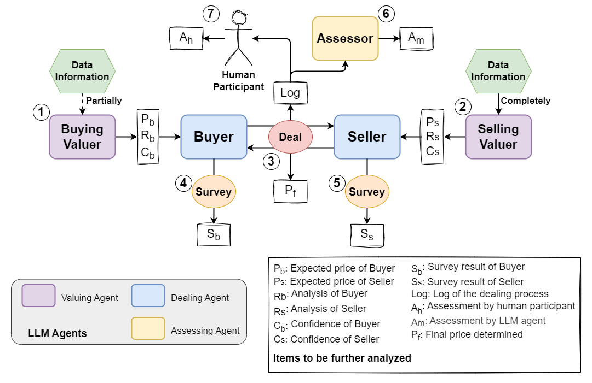

# AgentDealExp

Beaver:

设置 OpenAI 的 API 和安装所需库后，直接运行 `experiment.py` 即可。循环结构已写好，但目前只会执行第一轮。

基本结构已经完成，后续可根据需要进行修改。


目前执行一次实验大约需要 40-50 s。

多次运行后发现这个 agent 确实很蠢。

`prompt_factory` 感觉还是没必要且不方便，不做了。

## TODO：

1. 完善prompt
   
   (1) agent prompt 
   (2) instruction
   (3) survey
2. 明确历史记录部分如何设置
3. 明确市场因素具体类别
4. 修剪config中的冗余
5. 加更多api选择

## 问题：
经常无法成交。已经把判定放宽为差值10以内都认为成交。

## Structure：



⑦ 在代码中未实现。

## Local Setup

1. Clone the repository:
```bash
git clone https://github.com/SirBeaverB/AgentDealExp
cd AgentDealExp
```

2. Create and activate a virtual environment:

venv:
```bash
python -m venv your_env_name

source your_env_name/bin/activate  # On Unix/macOS
# OR
.\your_env_name\Scripts\activate  # On Windows
```
Conda:
```bash
conda create -n your_env_name python=x.x 
conda activate your_env_name    #Conda

```

3. Install dependencies:
```bash
pip install -r requirements.txt
```

4. Set API:

PowerShell:
```bash
$env:OPENAI_API_KEY = "[your_openai_api_key]"
```
cmd:
```bash
setx OPENAI_API_KEY "[your_openai_api_key]"
```

1. Run experiment
```bash
python experiment.py
```
You may change the arguments in `experiment.py`.